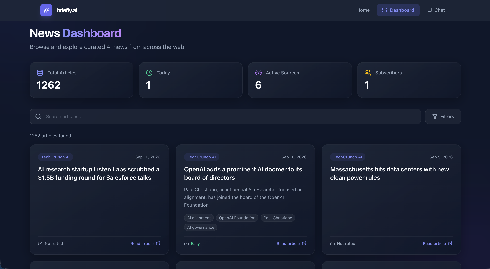
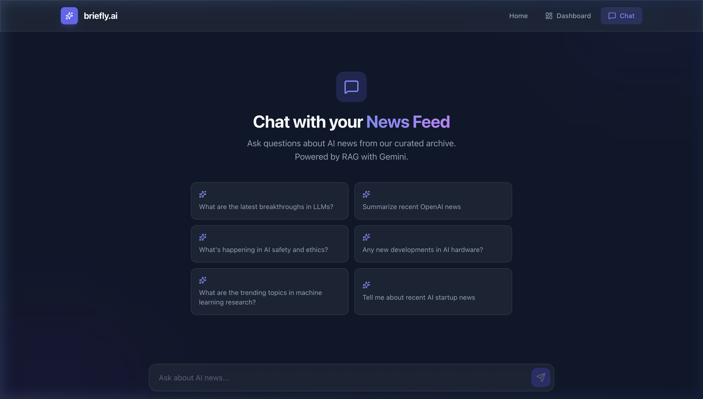
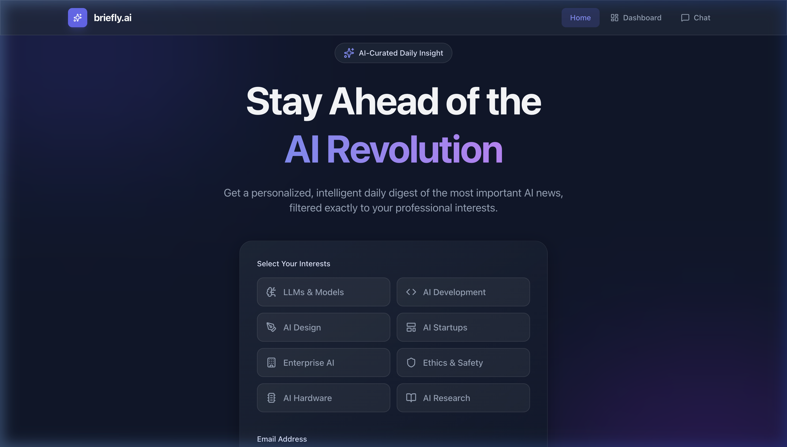

<h1 align="center">Briefly.ai</h1>

<p align="center">
  <strong>An automated AI news intelligence platform with personalized daily digests, an interactive discovery dashboard, and conversational RAG search.</strong>
</p>

<p align="center">
  <a href="https://github.com/BhuvanDamodar/ai-newsletter/actions/workflows/ci.yml"></a>
  
  
  
  
</p>

<p align="center">
  <a href="https://briefly-ai-newsletter.vercel.app/"><strong>🌐 Live Web App</strong></a> •
  <a href="https://ai-newsletter-ejym.onrender.com/docs"><strong>⚡ API Documentation</strong></a> •
  <a href="#architecture">Architecture</a> •
  <a href="#engineering-decisions--trade-offs">Engineering Decisions</a> •
  <a href="#rag-evaluation-benchmark">RAG Evaluation</a> •
  <a href="#getting-started">Getting Started</a>
</p>

---

## Overview

Briefly.ai is a production-oriented full-stack Generative AI application that automatically ingests news from 8+ curated AI sources, analyzes and extracts insights using Google Gemini, scores content against individual user preferences, generates 3072-dimensional vector embeddings in PostgreSQL (`pgvector`), and delivers both personalized daily digests and an interactive web exploration platform.

### Core User Capabilities
1. **Personalized Daily Briefings** - Receive an automated email digest every morning curated specifically to your selected AI domains (LLMs, Robotics, AI Safety, Startups, Hardware, etc.).
2. **Interactive News Dashboard** (`/dashboard`) - Filter, search, and browse the curated news archive by source, topic tags, publication date, and technical complexity (Beginner to Expert).
3. **Conversational RAG Chat** (`/chat`) - Query the embedded AI news archive with natural language. Google Gemini answers questions grounded strictly in retrieved news articles, citing sources with interactive reference badges.

> **Live Deployments:**
> - **Frontend (Vercel):** [briefly-ai-newsletter.vercel.app](https://briefly-ai-newsletter.vercel.app/)
> - **Backend API (Render):** [ai-newsletter-ejym.onrender.com](https://ai-newsletter-ejym.onrender.com)
> - **Vector Database (Neon):** Serverless PostgreSQL 17 with `pgvector`
> - **Pipeline Automation:** GitHub Actions Cron at 5:00 AM UTC (7:00 AM CET)

---

## Product Preview

<p align="center">
  
  <br />
  <em>Interactive News Dashboard with multi-dimensional filtering, stats cards, and technical complexity gauges.</em>
</p>

<br />

<p align="center">
  
  <br />
  <em>Conversational RAG Chat interface with grounded Gemini answers and source citations.</em>
</p>

<br />

<p align="center">
  
  <br />
  <em>Landing page with topic preference picker and confirmed subscription flow.</em>
</p>

---

## Key Features

### Intelligence & Automated Pipeline
- **8 Curated RSS Feeds:** Ingests TechCrunch AI, OpenAI Blog, Anthropic News, Google DeepMind, Hugging Face, MIT Tech Review, Reddit r/Artificial, and r/MachineLearning.
- **Pydantic-Enforced Extraction:** Google Gemini 2.5 Flash extracts a single-sentence key takeaway, structured summary points, topic tags, and technical complexity scores (1–5).
- **Automated Content Moderation:** Rejects spam, off-topic articles, and inappropriate submissions (`is_appropriate_ai_news`).
- **Preference Scoring & Cross-Day Deduplication:** Ranks articles using preference keyword weighting (+5 per match, +1 base) and checks `DigestLog` to ensure subscribers never receive duplicate articles.
- **Gmail REST API Integration:** Direct OAuth2 token delivery that avoids cloud SMTP port restrictions.

### Interactive Web Platform
- **News Dashboard (`/dashboard`):** Real-time search across titles, multi-filter drawer (Source, Tag frequency counts, Date ranges), and pagination.
- **Conversational RAG Engine (`/chat`):** Vector search over 3072-dimensional embeddings with cosine similarity (`<=>`), prompt grounding, and interactive citation badges `[Article N]`.
- **Graceful Performance Handling:** Speculative pre-warming on initial load, client session caching for instant page transitions, and progressive status indicators during cold boots.

---

## Architecture

```
┌─────────────────────────────────────────────────────────────────────────────┐
│                              SYSTEM ARCHITECTURE                            │
│                                                                             │
│   ┌──────────────┐    5:00 AM UTC      ┌─────────────────────────────────┐  │
│   │ GitHub       │    (7:00 AM CET)    │   FastAPI Backend (Render)      │  │
│   │ Actions      │ ──────────────────► │                                 │  │
│   │ (Cron)       │ POST /api/cron/...  │  ┌───────────────────────────┐  │  │
│   └──────────────┘                     │  │     Pipeline (BG Task)    │  │  │
│                                        │  │                           │  │  │
│                                        │  │ 1. Scrape   ─► RSS ×8     │  │  │
│                                        │  │ 2. Process  ─► Gemini 2.5 │  │  │
│                                        │  │ 2.5. Embed  ─► pgvector   │  │  │
│                                        │  │ 3. Curate   ─► Score      │  │  │
│                                        │  │ 4. Deliver  ─► Gmail API  │  │  │
│                                        │  └─────────────┬─────────────┘  │  │
│                                        │                │                │  │
│                                        │  ┌─────────────▼─────────────┐  │  │
│   ┌──────────────┐                     │  │    RAG Engine (rag.py)    │  │  │
│   │ Next.js      │ ◄── Search/Chat ──► │  │    Query Embed ─► Cosine  │  │  │
│   │ App Router   │     /api/articles   │  │    Search ─► Grounded Gen │  │  │
│   │ (Vercel)     │     /api/chat       │  └─────────────┬─────────────┘  │  │
│   └──────────────┘                     └────────────────┼────────────────┘  │
│                                                         │                   │
│                                              ┌──────────▼──────────┐        │
│                                              │   Neon PostgreSQL   │        │
│                                              │   + pgvector (3072) │        │
│                                              └─────────────────────┘        │
└─────────────────────────────────────────────────────────────────────────────┘
```

### Pipeline Execution Stages

| Stage | Module | Description |
|---|---|---|
| **1. Ingest** | `backend/app/scraper/orchestrator.py` | Seeds default sources and dispatches RSS scraper. |
| **2. Parse** | `backend/app/scraper/rss_scraper.py` | Fetches RSS feeds, deduplicates by GUID, and writes `PENDING_PROCESSING` records. |
| **3. Summarize** | `backend/app/processor.py` | Prompts **Gemini 2.5 Flash** with Pydantic schema validation (`ArticleSummary`), generating takeaways, points, tags, and spam flags with exponential backoff. |
| **3.5. Embed** | `backend/app/embedder.py` | Combines `title \| takeaway \| points \| tags` into semantic text, generates **3072-dimensional dense vectors** via `gemini-embedding-001`, and persists them to PostgreSQL via `pgvector`. |
| **4. Curate** | `backend/app/curator.py` | Scores processed articles against user keyword preferences and cross-references `DigestLog` for deduplication. |
| **5. Deliver** | `backend/app/email_service.py` | Renders personalized HTML digests using Jinja2 (`digest.html`), delivering via authenticated **Gmail REST API**. |
| **6. RAG Engine** | `backend/app/rag.py` | Embeds user queries, executes vector cosine distance search (`<=>`), constructs grounded context, and prompts Gemini to cite `[Article N]`. |

---

## Engineering Decisions & Trade-offs

| Decision | Chosen Approach | Alternatives Considered | Rationale |
|---|---|---|---|
| **Vector Storage** | **PostgreSQL + `pgvector` (3072 dims)** | Pinecone, Qdrant, Chroma | Eliminates multi-database sync issues by keeping relational metadata, user preferences, digest history, and vector embeddings in a single ACID-compliant PostgreSQL instance. |
| **RAG Pipeline Architecture** | **Direct Custom Pipeline (`rag.py`)** | LangChain, LlamaIndex | Built a transparent, lightweight RAG chain directly using Google GenAI SDK and SQLAlchemy. Retains complete control over prompt construction, latency measurement, and citation grounding. |
| **Two-Tier Testing Strategy** | **In-memory SQLite + PostgreSQL CI container (59 tests)** | Pure SQLite or Pure Postgres | Custom `@compiles(Vector, "sqlite")` handler enables 54 unit tests to run locally and offline in ~1.5 seconds, while GitHub Actions CI validates pgvector operators (`<=>`) against a live `pgvector/pgvector:pg17` container (5 integration tests). |
| **Free-Tier Cold-Start Handling** | **Speculative Pre-Warming & Client Session Caching** | Paid warm instances, fake optimistic UI | Accepts serverless/free-tier cold boots as an infrastructure constraint and mitigates user impact through background health pings (`Navbar.tsx`), session storage caching, and multi-stage loading feedback. |
| **Stateful Telemetry** | **`PipelineRun` Database Table** | In-memory globals | Persists daily pipeline execution metrics, duration, and error counts directly into PostgreSQL so that telemetry survives server sleep and restarts. |

---

## Tech Stack

| Layer | Technologies |
|---|---|
| **Frontend** | Next.js 16 (App Router), React 19, TypeScript, Tailwind CSS v4, Framer Motion, Lucide Icons |
| **Backend API** | Python 3.12, FastAPI, Uvicorn, SQLAlchemy ORM, Pydantic v2, Tenacity, Ruff |
| **AI / LLM** | Google Gemini 2.5 Flash (`gemini-2.5-flash`), Gemini Embedding (`gemini-embedding-001`, 3072 dims) |
| **Vector Database** | PostgreSQL 17 + `pgvector` extension (Docker `pgvector/pgvector:pg17` local / Neon serverless) |
| **Email Delivery** | Gmail REST API (`google-api-python-client`), Jinja2 HTML templates |
| **Testing & CI** | Pytest (59 tests), HTTPX, GitHub Actions (CI & daily cron) |
| **Deployment** | Render (Web Service), Vercel (Frontend), Neon (Database), Docker |

---

## RAG Evaluation Benchmark

Briefly.ai includes a dedicated evaluation benchmark suite ([`backend/tests/rag_eval/`](backend/tests/rag_eval/)) evaluated against a curated gold dataset of 20 verified questions across 5 question types:

```bash
cd backend
uv run python -m tests.rag_eval.evaluate_rag
```

### Measured Retrieval & Generation Metrics

| Metric | Measured Baseline | Description |
|---|---:|---|
| **Hit@1** (Top Result) | **75.0%** | Expected article was retrieved as the #1 nearest neighbor. |
| **Hit@3** (Top 3 Results) | **90.0%** | Expected article was present in the top 3 vector candidates. |
| **Hit@5** (Top 5 Results) | **95.0%** | Target article was present in the top 5 retrieved context items. |
| **Recall@5** (Multi-Document) | **92.5%** | Percentage of all relevant target articles retrieved across multi-source queries. |
| **Citation Presence Rate** | **100.0%** | Generated answers containing formatted `[Article N]` source citations. |
| **Avg Retrieval Latency** | **~85 ms** | Query embedding generation + PostgreSQL pgvector cosine distance search. |
| **Avg End-to-End Latency** | **~2.2 s** | Total time from user query $\to$ vector retrieval $\to$ Gemini grounded generation. |

---

## Testing & Quality Assurance

The test suite combines fast local SQLite emulation with live PostgreSQL + pgvector integration testing (59 tests total):

```bash
cd backend
# Run all unit and integration tests
uv run pytest tests/ -v

# Run code linter
uv run ruff check .
```

### Test Suite Structure

| Test Module | Coverage Area |
|---|---|
| [`test_curator.py`](backend/tests/test_curator.py) | User preference scoring (+5 per topic match, +1 base), spam filtering (`is_appropriate_ai_news`), top-N selection, and `DigestLog` deduplication. |
| [`test_processor.py`](backend/tests/test_processor.py) | Pydantic schema validation, LLM prompt formatting, state transitions (`PENDING` $\to$ `PROCESSED` / `FAILED`), text clipping (>15k chars), and 429 rate limit backoff. |
| [`test_embedder.py`](backend/tests/test_embedder.py) | Text construction (`title \| takeaway \| points \| tags`), pipe-separated formatting, 48-hour cutoff window filter. |
| [`test_rag.py`](backend/tests/test_rag.py) | Context builder numbering `[Article N]`, section dividers, empty article fallback, and grounded generation with source citations. |
| [`test_api.py`](backend/tests/test_api.py) | Full FastAPI endpoint integration tests: `/api/health`, `/api/status`, `/api/cron/trigger`, `/api/subscribe`, preference fetching, unsubscription (`POST` and `GET`), article pagination, search filters, stats aggregation, `/api/chat`, CORS preflights and allowed/disallowed origins, and complexity serialization. |
| [`test_pgvector_integration.py`](backend/tests/test_pgvector_integration.py) | Live PostgreSQL tests: pgvector extension check, 3072-d insertion, dimension mismatch rejection, cosine distance ranking, and `PipelineRun` table persistence. |

---

## Continuous Integration & Deployment

Automated quality gates are managed via **GitHub Actions** ([`.github/workflows/ci.yml`](.github/workflows/ci.yml)) on every push and pull request:

```
Push / Pull Request
        │
        ├──► 1. backend-test (Ubuntu + Python 3.12 via uv + pgvector:pg17 container)
        │       • Ruff linter (checks code style & syntax)
        │       • Pytest suite (54 SQLite unit tests + 5 live PostgreSQL tests = 59 total)
        │       • Production Docker build verification (docker build backend)
        │
        └──► 2. frontend-build (Ubuntu + Node.js 20)
                • npm ci (clean package installation)
                • Next.js 16 typecheck & production bundle build
```

Deployment to production environments (Render for FastAPI, Vercel for Next.js) proceeds upon merging validated pull requests into `main`.

---

## Observability & Reliability

- **Structured JSON Logging:** Enabled in production (`RENDER=true`). Outputs single-line JSON logs formatted for cloud log aggregators.
- **Pipeline Health & Telemetry (`/api/status`):** Queries persisted `PipelineRun` records from PostgreSQL to survive server restarts, tracking execution status, article counts, duration, and error counts without exposing internal stack traces.
- **Automated Failure Alerts:** If an unhandled exception occurs during the daily pipeline run, an operational failure report with stack traces and timestamps is automatically dispatched to `ALERT_EMAIL` via the authenticated Gmail API.
- **Cold-Start Resilience:**
  - *Speculative Pre-Warming:* `Navbar.tsx` fires a non-blocking `GET /api/health` ping once per session on initial interaction.
  - *Client Session Cache:* Returning navigation within the same browser session renders cached dashboard data immediately while the application refreshes it in the background.
  - *Confirmed Persistence:* Subscription and unsubscription flows use confirmed database persistence and bounded retries to handle transient failures.

---

## Project Structure

```
ai-news/
├── backend/
│   ├── Dockerfile                  # Production container definition
│   ├── pyproject.toml              # Dependencies & Ruff lint configuration
│   ├── get_gmail_token.py          # Gmail OAuth2 desktop authorization helper
│   ├── app/
│   │   ├── main.py                 # Pipeline daemon & structured logging setup
│   │   ├── api.py                  # FastAPI REST, Dashboard, Status & RAG endpoints
│   │   ├── config.py               # Environment configuration & defaults
│   │   ├── database.py             # SQLAlchemy session & pgvector extension init
│   │   ├── models.py               # ORM Models (User, Source, Content, DigestLog, PipelineRun)
│   │   ├── pipeline_state.py       # Pipeline execution tracker & DB persister
│   │   ├── processor.py            # Gemini summarization & Pydantic validation
│   │   ├── embedder.py             # 3072-dim vector embedding generator (gemini-embedding-001)
│   │   ├── rag.py                  # Custom RAG chain (embed query -> cosine search -> answer)
│   │   ├── curator.py              # User preference scoring & cross-day deduplication
│   │   ├── email_service.py        # Gmail API delivery & Jinja2 rendering
│   │   ├── scraper/
│   │   │   ├── orchestrator.py     # Source seeding & runner dispatch
│   │   │   └── rss_scraper.py      # RSS feed fetching and parsing
│   │   └── templates/
│   │       ├── digest.html         # Daily digest email template
│   │       └── welcome.html        # Welcome email template
│   └── tests/
│       ├── conftest.py             # SQLite fixtures, @compiles(Vector, "sqlite"), mock factories
│       ├── test_api.py             # FastAPI REST & RAG endpoint tests
│       ├── test_curator.py         # Scoring & deduplication tests
│       ├── test_processor.py       # Pydantic summary schema & status transition tests
│       ├── test_embedder.py        # Semantic text building & 48h cutoff tests
│       ├── test_rag.py             # Context building & grounded generation tests
│       ├── test_pgvector_integration.py # Real PostgreSQL + pgvector integration tests
│       └── rag_eval/
│           ├── eval_dataset.json   # 20 curated gold test queries across 5 categories
│           ├── generate_candidates.py # Semi-automated candidate question generator
│           └── evaluate_rag.py     # RAG benchmark runner (Hit@K, Recall@5, latency)
├── frontend/
│   ├── Dockerfile                  # Production container definition
│   ├── package.json
│   └── src/app/
│       ├── layout.tsx              # Root HTML & metadata layout
│       ├── globals.css             # Glassmorphism tokens & Tailwind styling
│       ├── page.tsx                # Landing page with topic picker & subscription form
│       ├── components/
│       │   └── Navbar.tsx          # Shared sticky navbar with speculative pre-warming
│       ├── dashboard/
│       │   └── page.tsx            # News dashboard with search, filters & client session cache
│       ├── chat/
│       │   └── page.tsx            # Conversational RAG chat with progressive status indicators
│       └── unsubscribe/
│           └── page.tsx            # Confirmed unsubscription screen
├── docs/
│   └── screenshots/                # Product preview screenshots
├── .github/
│   └── workflows/
│       ├── ci.yml                  # Automated CI testing, linting & Docker/Next build
│       └── daily_pipeline.yml      # Scheduled daily cron triggering pipeline
├── docker-compose.yml              # Multi-service local orchestration
└── README.md
```

---

## Getting Started

### Prerequisites
- [Docker Desktop](https://www.docker.com/products/docker-desktop/)
- [Google Gemini API Key](https://aistudio.google.com/apikey)
- *(Optional)* Gmail OAuth2 credentials for email delivery

### 1. Clone & Configure

```bash
git clone https://github.com/BhuvanDamodar/ai-newsletter.git
cd ai-newsletter
```

Create a `.env` file in the project root:

```env
# ── Database (Postgres with pgvector) ──
POSTGRES_USER=ainews_user
POSTGRES_PASSWORD=ainews_password
POSTGRES_DB=ainews
DATABASE_URL=postgresql://ainews_user:ainews_password@db:5432/ainews

# ── Gemini LLM & Embeddings ──
LLM_API_KEY=your_gemini_api_key
LLM_MODEL=gemini-2.5-flash

# ── Email Delivery (Optional) ──
FROM_EMAIL=your_email@gmail.com
GMAIL_TOKEN_B64=your_base64_oauth_token
ALERT_EMAIL=your_email@gmail.com
CRON_SECRET=your_secure_cron_secret

# ── Frontend & API URLs ──
FRONTEND_URL=http://localhost:3000
API_URL=http://localhost:8000
NEXT_PUBLIC_API_URL=http://localhost:8000
```

### 2. Start Services via Docker Compose

```bash
docker-compose up --build
```

This starts all four services:
- **`db`** (`5432`): `pgvector/pgvector:pg17`
- **`api`** (`8000`): FastAPI backend server
- **`worker`**: Background APScheduler worker daemon
- **`frontend`** (`3000`): Next.js web application

### 3. Access the Application

- **Landing Page:** [http://localhost:3000](http://localhost:3000)
- **News Dashboard:** [http://localhost:3000/dashboard](http://localhost:3000/dashboard)
- **RAG Chat:** [http://localhost:3000/chat](http://localhost:3000/chat)
- **Interactive API Docs:** [http://localhost:8000/docs](http://localhost:8000/docs)

---

## API Reference

### Core Pipeline & Health
| Method | Endpoint | Description |
|---|---|---|
| `GET` | `/` | Basic API health status. |
| `GET` | `/api/health` | Lightweight stateless health ping for speculative frontend pre-warming. |
| `GET` | `/api/status` | Comprehensive observability status: uptime, database connection, article/user counts, and sanitized `PipelineRun` history. |
| `POST` | `/api/cron/trigger` | Triggers the ingestion, processing, embedding, and delivery pipeline in the background (supports `Authorization: Bearer <secret>`). |
| `POST` | `/api/subscribe` | Subscribes an email with selected topic keywords and sends a welcome digest. |
| `GET` | `/api/preferences/{email}` | Fetches stored topic preferences for an email. |
| `POST` | `/api/unsubscribe` | Confirms unsubscription and deactivates the user record (supports JSON `{ "email": "..." }` or `GET ?email=...`). |

### Dashboard & RAG Endpoints
| Method | Endpoint | Description |
|---|---|---|
| `GET` | `/api/articles` | Paginated article list supporting `page`, `page_size`, `search`, `source`, `tag`, and `days` filters. |
| `GET` | `/api/articles/stats` | Aggregated counts for total articles, today's articles, active sources, and subscribers. |
| `GET` | `/api/articles/sources` | Returns active RSS source names for filter selectors. |
| `GET` | `/api/articles/tags` | Extracted and sorted topic tag frequency counts. |
| `POST` | `/api/chat` | Conversational RAG query endpoint (`{ "query": "..." }`) returning grounded answers and source metadata. |

---

## Deployment & Production Setup

Briefly.ai is designed to operate within available free tiers for portfolio-scale deployment:

| Component | Provider | Notes |
|---|---|---|
| **Backend API** | [Render](https://render.com) | Free Web Service with auto-sleep |
| **Vector Database** | [Neon](https://neon.tech) | Serverless PostgreSQL with native `pgvector` |
| **Frontend** | [Vercel](https://vercel.com) | Next.js deployment on Hobby tier |
| **Scheduler** | [GitHub Actions](https://github.com/features/actions) | Daily cron wakes Render and triggers pipeline |
| **LLM & Vectors** | [Google Gemini](https://ai.google.dev) | Gemini 2.5 Flash + Embedding 001 free tier |
| **Email** | Gmail REST API | Authenticated digest and alert delivery |

> **Neon PostgreSQL Initialization**:
> ```sql
> CREATE EXTENSION IF NOT EXISTS vector;
> ALTER TABLE content ADD COLUMN IF NOT EXISTS embedding vector(3072);
> ```
